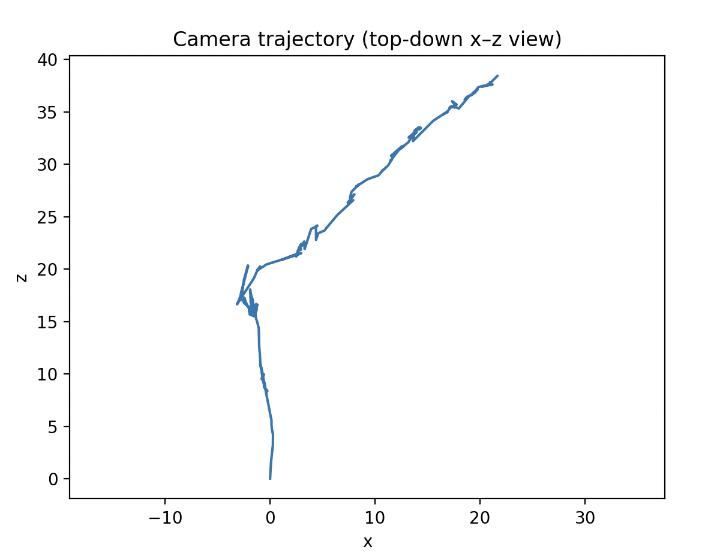

# Mini Monocular SLAM (Python)

This project is a small monocular SLAM system written in Python.

Given a single RGB video and an approximate focal length, it:

* Extracts ORB features and tracks them across frames.
* Estimates relative camera motion using an essential matrix and RANSAC.
* Triangulates 3D map points.
* Refines camera poses using a PnP-based optimizer (no external C++ optimizer required).
* Maintains a sparse 3D point map and a camera trajectory.
* Shows a live 2D viewer with feature tracks.
* Can export the 3D map and trajectory for offline 3D visualization.

It is meant as a learning / experimentation project, not a production SLAM system.

---

## Features

* Monocular pipeline using a single RGB camera.
* ORB feature detection and description.
* Brute-force feature matching with Hamming distance and Lowe’s ratio test.
* Essential matrix estimation via RANSAC with a custom model.
* Pose initialization from the essential matrix (rotation and translation).
* Triangulation of new 3D points between frames.
* Search by projection to re-associate old map points in new frames.
* Pose refinement with a PnP solver from OpenCV, treating 3D points as fixed.
* Basic map maintenance based on reprojection error and age of points.
* Live 2D visualization of feature tracks.
* Offline 3D visualization of the reconstructed map and camera path.

---

## Requirements

Tested with:

* Python 3.9 or newer.
* macOS; Linux should also work with the same dependencies.

Main Python packages you will need:

* NumPy
* OpenCV (Python bindings)
* SciPy
* scikit-image
* pygame (for the 2D viewer)
* matplotlib (for the offline 3D viewer)

It is recommended to install these inside a virtual environment.

---

## Repository Layout

Key files and directories:

* `slam.py` – main script that runs SLAM on a video.
* `frame.py` – frame representation, feature extraction, and matching.
* `pointmap.py` – 3D points, map management, and PnP-based pose refinement.
* `helpers.py` – math helpers (triangulation, essential matrix, normalization, etc.).
* `display.py` – display utilities (2D viewer currently used).
* `renderer.py` – utilities for synthetic scenes used by the fake SLAM test.
* `fakeslam.py` – toy SLAM on a synthetic scene.
* `constants.py` – tuned constants such as RANSAC thresholds and culling thresholds.
* `tools/parse_ground_truth.py` – helper for converting ground-truth files.
* `videos/` – test videos and, for some sequences, matching ground-truth pose files.
* Any precompiled shared libraries under `lib/` are legacy and not used by the current pipeline.

---

## Running the System

### Basic run with a test video

From the repository root, run SLAM on a video by providing:

* The focal length in pixels via the environment variable `F`.
* The path to the video as the first argument.

Example (Freiburg-style video with focal length 525 px):

* Set `F` to the desired focal length.
* Run the main script with something like:
  `F=525 python slam.py videos/test_freiburgxyz525.mp4`

If you do not set `HEADLESS`, a 2D viewer window will open showing the current frame with tracked features and trails.

### Headless mode

To run without any display windows (for example over SSH or when only logs and 3D export are needed), set the `HEADLESS` environment variable before running:

* Example: `HEADLESS=1 F=525 python slam.py videos/test_freiburgxyz525.mp4`

In this mode, progress is printed only to the console.

---

## Environment Variables

The following environment variables control runtime behavior:

* `F`
  Required. Focal length in pixels. Typical values depend on the dataset (for example, 525 for some Freiburg sequences).

* `HEADLESS`
  If set to any value, disables all display windows and runs in console-only mode.

* `REVERSE`
  If set, flips the direction of the recovered translation from the essential matrix. This is useful for sequences that are played in reverse or require flipping the motion direction.

* `SEEK`
  If set to an integer value, seeks the video to that frame index before starting SLAM. Useful for jumping into the middle of a sequence.

---

## Using Ground Truth

Some videos in the `videos/` directory have associated ground-truth pose files in NumPy `.npz` format.

To run with ground truth:

* Use the video as the first argument.
* Use the ground-truth `.npz` file as the second argument.

For example, with a Freiburg “rpy” sequence that has a 525 px focal length and a matching pose file, you would run something like:

* `F=525 python slam.py videos/test_freiburgrpy525.mp4 videos/test_freiburgrpy525.npz`

The main script will load the ground-truth poses from the `.npz` file and can use them for comparison or to adjust scale.

---

## Output During a Run

For each frame, the program prints information such as:

* Number of descriptor matches and RANSAC inliers.
* Number of map points culled in this step.
* A numeric “Pose” value indicating error from pose refinement.
* Number of new points added from triangulation and from search-by-projection.
* Total number of map points and frames in the map.
* Time spent processing the current frame in milliseconds.
* The current camera pose as a 4×4 transformation matrix.

This output is useful to monitor tracking quality and performance over time.

---

## 3D Map and Trajectory Export

At the end of a run, the system can export:

* All 3D map point positions.
* The full sequence of camera positions.

These are saved together into a compressed NumPy archive file (for example named `map_and_poses.npz`). It contains two arrays:

* `points`: each row is a 3D point in world coordinates.
* `poses`: each row is the 3D position of the camera in world coordinates at each frame.

You can then create a separate script (outside of this README) that:

* Loads this archive file.
* Plots the 3D points as a sparse point cloud.
* Plots the camera positions as a connected line.
* Uses matplotlib’s 3D functionality to orbit around and inspect the reconstruction.

A common choice is to view the scene from above (treating x and z as the horizontal axes and y as vertical), but the exact visualization is up to you.

---

## Implementation Details

Some important design notes:

* Pose between consecutive frames is initialized by estimating an essential matrix from matched, normalized keypoints and decomposing it into rotation and translation.
* A custom essential-matrix model is used together with scikit-image’s RANSAC implementation to robustly handle outliers.
* PnP-based pose refinement is used to adjust camera extrinsics using existing 3D map points, with an OpenCV solver. The 3D points themselves are kept fixed in this step.
* New 3D points are created by triangulation only when certain consistency checks are satisfied, including depth sign and reprojection error thresholds.
* Search-by-projection reprojects known 3D points into the current frame, finds nearby keypoints, and verifies descriptor distance before associating them.
* Map maintenance removes points with consistently high reprojection error or very few observations that are also old compared to the current frame index.
* As with any purely monocular system, the absolute scale of the reconstruction is arbitrary and must be aligned to external information (such as ground truth) if metric distances are needed.

---

## Limitations

This project is intentionally minimal and has several limitations:

* No loop closure or global pose graph optimization.
* No explicit keyframe selection beyond the basic frame handling.
* No multi-scale feature extraction or advanced outlier rejection strategies.
* No guarantees of real-time performance on all hardware.

It is best considered a teaching and experimentation tool for understanding the main components of a monocular SLAM pipeline.

---
